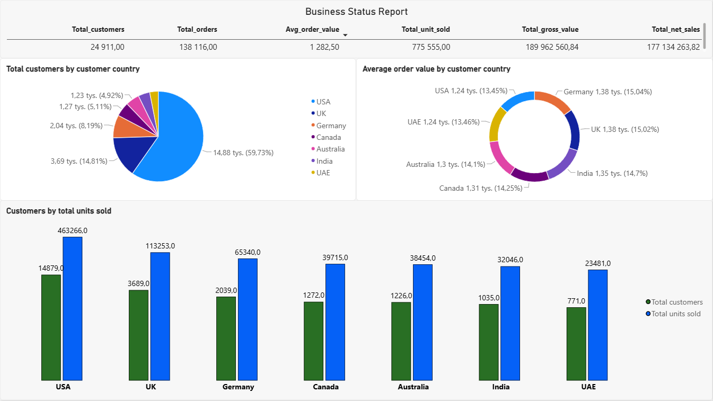
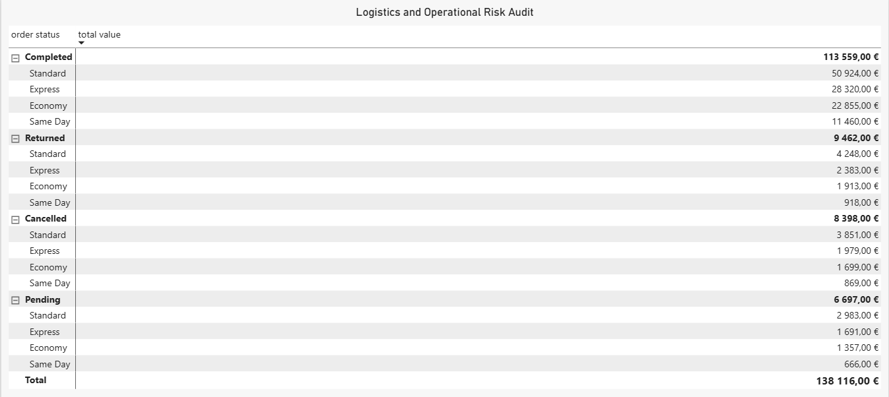
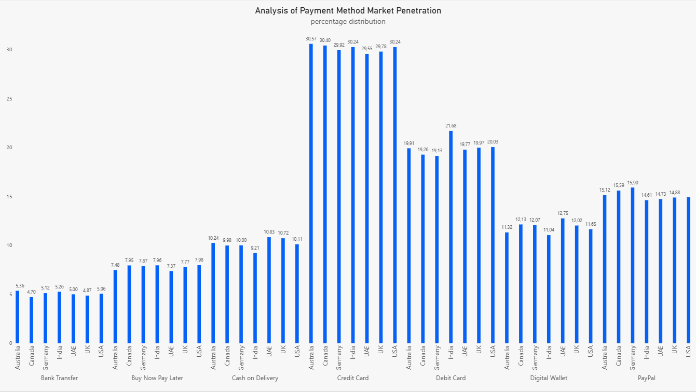
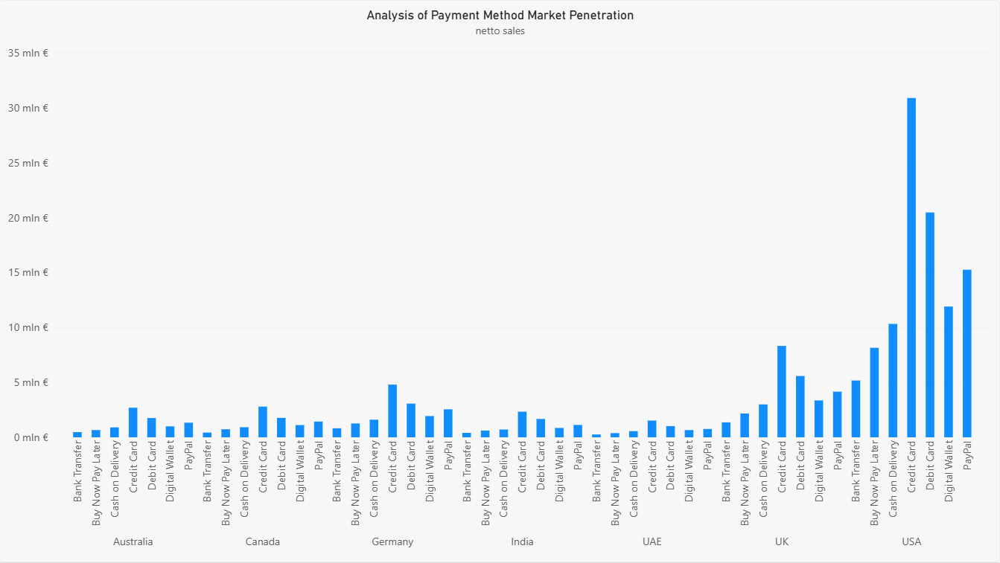

🛒 E-Commerce Sales & Customer Analytics (PostgreSQL + Power BI)

📌 Project Overview

This project delivers an end-to-end business intelligence and data analytics solution exploring customer demographics, sales performance, fulfillment logistics, and payment methods penetration.
The primary objective was to model raw transactional data into a Star Schema, construct optimized database semantic views in PostgreSQL, and build an executive Power BI dashboard tailored for C-level (CEO) decision-making.

📊 Key Insights & Business Findings

- Market Dominance & Revenue Concentration: The USA market drives the highest sales volume and gross revenue (~$31M+ in credit card transactions alone), while UK and Germany demonstrate high Average Order Value (AOV) consistency.
- Payment Gateway Penetration: Credit Cards maintain an overwhelming market share (~30%) across all regions, followed by Debit Cards (~20%). Regional preferences highlight the necessity of maintaining localized payment channels to prevent checkout churn.
- Logistics & Operational Risk: Over $17.8K in potential revenue is tied up in Returned ($9.4K) and Cancelled ($8.3K) orders, with 'Standard Shipping' experiencing the highest volume of fulfillment disruptions.
- Executive Performance Tracking: High alignment between gross ($189.9M) and net revenue ($177.1M) validates promotion strategies and pricing margins across regions.

🛠️ Tech Stack & Methodology

- Database Engine: PostgreSQL
- BI & Data Visualization: Power BI Desktop
- Data Modeling & Transformation: Star Schema (Fact & Dimension Tables), SQL Views, Window Functions, Power Query
- Concepts Applied: Business Data Modeling, Semantic SQL Views, Aggregations (`SUM`, `COUNT DISTINCT`), Window Functions (`OVER PARTITION BY`), Explicit Casting (`::numeric`), Matrix & 100% Stacked Visualizations.

🗄️ Database Architecture & SQL Views

The analytical layer separates data preparation from visualization logic using modular, highly optimized PostgreSQL views.

1. Executive KPI Summary View (`vw_exec_kpi_summary`)
Provides a single-row executive KPI summary of total orders, unique customers, revenue (gross vs. net), and Average Order Value (AOV).

```sql
CREATE OR REPLACE VIEW vw_exec_kpi_summary AS
SELECT 
    COUNT(fs.order_id) AS total_orders,
    COUNT(DISTINCT fs.customer_id) AS total_customers,
    SUM(fs.gross_sales) AS total_gross_value,
    SUM(fs.net_sales) AS total_net_sales,
    SUM(fs.quantity) AS total_unit_sold,
    ROUND(SUM(fs.net_sales) / NULLIF(COUNT(fs.order_id), 0), 2) AS avg_order_value
FROM fact_sales fs;
```

Customer Geography & Performance View (vw_customer_performance)
Evaluates customer volume, total net revenue, and AOV grouped by geographic markets.

```sql
CREATE OR REPLACE VIEW vw_customer_performance AS
SELECT 
    dc.customer_country,
    COUNT(DISTINCT fs.customer_id) AS total_customers,
    COUNT(fs.order_id) AS total_orders,
    SUM(fs.net_sales) AS total_net_sales,
    ROUND(SUM(fs.net_sales) / NULLIF(COUNT(fs.order_id), 0), 2) AS avg_order_value,
    SUM(fs.quantity) AS total_units_sold
FROM fact_sales fs
LEFT JOIN dim_customers dc ON fs.customer_id = dc.customer_id
GROUP BY dc.customer_country;
```

Order Fulfillment & Risk View (vw_order_fulfillment_status)
Analyzes logistics methods and identifies revenue leakage across cancelled, pending, and returned orders.

```sql
CREATE OR REPLACE VIEW vw_order_fulfillment_status AS
SELECT
    fs.shipping_method,
    fs.order_status,
    COUNT(fs.order_id) AS total_orders,
    SUM(fs.quantity) AS total_quantity,
    SUM(fs.profit) AS total_profit,
    SUM(fs.net_sales) AS total_net_sales
FROM fact_sales fs
GROUP BY fs.shipping_method, fs.order_status;
```

Payment Method Penetration View (vw_percentage_share_payment_method_analysis)
Leverages advanced SQL Window Functions to calculate the percentage market share of payment methods partitioned by country.

```sql
CREATE OR REPLACE VIEW vw_percentage_share_payment_method_analysis AS
SELECT
    dc.customer_country,
    fs.payment_method,
    SUM(fs.net_sales)::numeric(12,2) AS net_sales_per_method,
    ROUND(
        (SUM(fs.net_sales) / SUM(SUM(fs.net_sales)) OVER(PARTITION BY dc.customer_country)) * 100, 
        2
    )::numeric(10,2) AS pct_share_within_country
FROM fact_sales fs
LEFT JOIN dim_customers dc ON fs.customer_id = dc.customer_id
GROUP BY dc.customer_country, fs.payment_method;
```

📈 Power BI Dashboard Highlights

The interactive e-commerce_bi.pbix report is tailored for C-Level decision-makers across four functional views:

1. Executive Business Status Report
Provides high-level KPI metrics alongside side-by-side geographic volume and average order value distribution.


3. Logistics & Operational Risk Audit
Hierarchical matrix highlighting fulfillment status bottlenecks, canceled orders, and revenue tied up in returns.


5. Payment Method Market Penetration (Net Sales vs Percentage Distribution)
Comparative analysis isolating raw monetary volume versus normalized market share percentage across global regions.



📁 Project Structure
```
E-Commerce_/
|
├── asset/
│   ├── analysis_payment_netto.png
|   ├── analysis_payment_percentage.png
|   ├── buisnes_status_report.png
|   ├── logistics_risk.png
├── power_bi/
|   ├── e-commerce_bi.pbix
├── raw_data/
│   ├── customer_master.csv
│   ├── ecommerce_sales_customer_analytics_150k.csv
│   ├── order_items.csv
├── sql/
│   ├── 01_schema_ddl.sql
│   ├── 02_data_ingestion.sql
│   ├── 03_data_cleaning.sql
│   └── 04_analytics_views.sql
├── view/
│   ├── vw_customer_performance_202609261037.csv
│   ├── vw_exec_kpi_summary_202609261036.csv
│   ├── vw_order_fulfillment_status_202609261038.csv
|   ├── vw_payment_method_analysis_202609261038.csv
│   └── vw_percentage_share_payment_method_analysis_202609261514.csv
│
└── README.md
```

👨‍💻 Author
Daniel Żebrowski

Aspiring Data Analyst | SQL, Power BI & Python

LinkedIn: [Daniel Żebrowski](https://www.linkedin.com/in/daniel-%C5%BCebrowski-7a0937211/)

GitHub: @DanielZebrowski-Data
